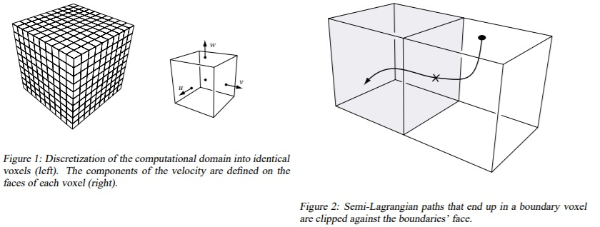

# Smoke simulation 

**Marker-and-Cell grid setup** 

**Vorticity Confinement Epsilon 0.1** 

**Vorticity Confinement Epsilon 0.5** 

**Vorticity Confinement Epsilon 1.0** 

**Biasing example when computing vorticity confinement without cell-centered velocities** 

